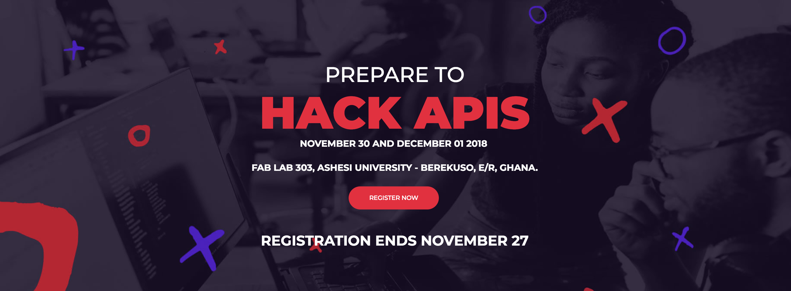

# Hack APIs:Connect Hackathon

## About the Event

**This is a 2-day Hackathon happening at the Ashesi University campus from 30th November 2018 to 1st December 2018. API: Connect would have cash prizes and swags for the winning teams which would be the best 3 projects. The participating teams would have a number of 3 to 4 individuals each. Food and all required logistics would be provided for participants except transportation to the venue.**

Each participant is free to build awesome products on provided APIs and services but must meet certain criteria, including:

* **Solutions must have a real-world use case.**
* **Participants must utilize at least one of the sponsors API. \(Cloudinary API\). Familiarize themselves with the API but trainers will be on sight to assist them with the integration**
* **Solutions will be open-sourced on GitHub.**

\*\*\*\*

## **Event Flow**

###                                                              **Friday 30-11:** 

**14:00 - 15:00**

| **Speeches & Introduction from the hosts and sponsors** | Opening Ceremony |
| :--- | :---: |

15

