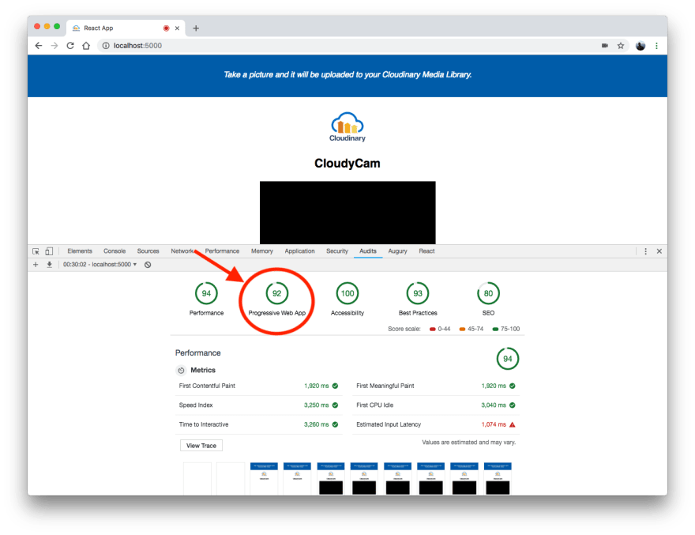
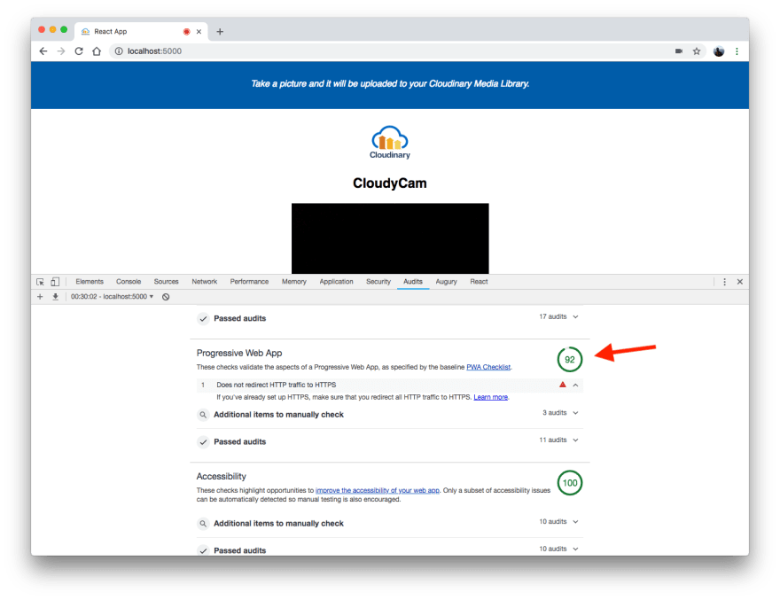

# Creating a Production Build and Auditing Your PWA

To serve your app in production mode as a PWA to users, first edit the CloudyCam manifest to read like this:

```text
    # public/manifest.json
    {
        "short_name": "CloudyCam",
        "name": "Clodinary Offline PWA Camera",
        "icons": [
            {
                "src": "favicon.ico",
                "sizes": "512x512 192x192 64x64 32x32 24x24 16x16",
                "type": "image/x-icon"
            }
        ],
        "start_url": "./index.html",
        "display": "standalone",
        "theme_color": "#000000",
        "background_color": "#ffffff"
    }
```

Recall that the `index.js` file contains this line of code:

```text
    registerServiceWorker();
```

It creates a service worker that caches the various assets and sections of your app so that even when your users are offline or have a poor Internet connection, they can still interact with and use CloudyCam.

Create a production build by running this command:

```text
    yarn build # or npm run build
```

Yarn then creates an optimized production build of your app and places it in the `build` directory, ready for your users.

Serve the production build with the `serve` JavaScript package by running these two commands:

```text
    yarn global add serve # or npm install -g serve
    serve -s build
```

Afterwards, Yarn creates a simple static server on `http://localhost:5000`. Go to that URL for the production version of your app.

A panel on **Google Chrome’s Developer Console**, powered by [Lighthouse](https://developers.google.com/web/tools/lighthouse/), enables you to validate the quality of your web pages. Click the **Audits** tab of the **Developer Console** and run an audit on the production build. The results are then displayed, as in this example:





Here, CloudyCam is shown as a 100-percent PWA even though the score reads 92. Not to worry: The remaining 8 percent will be achieved once your production server is running with HTTPS for all the app traffic.

