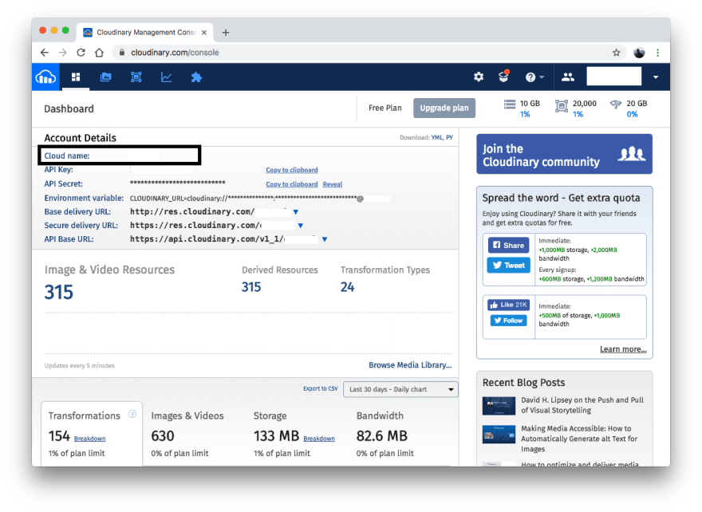
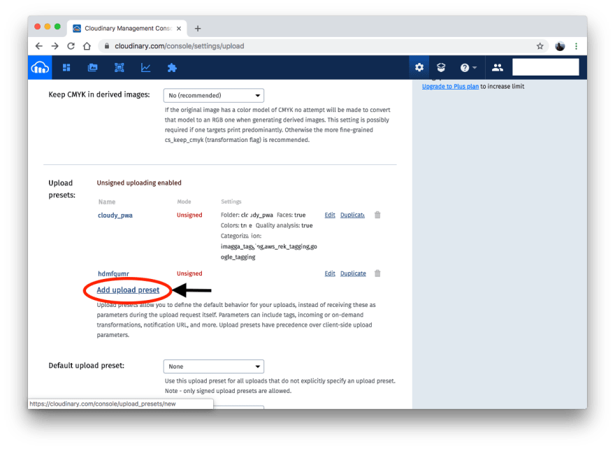
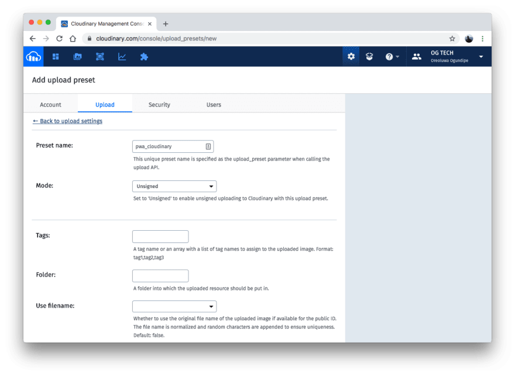
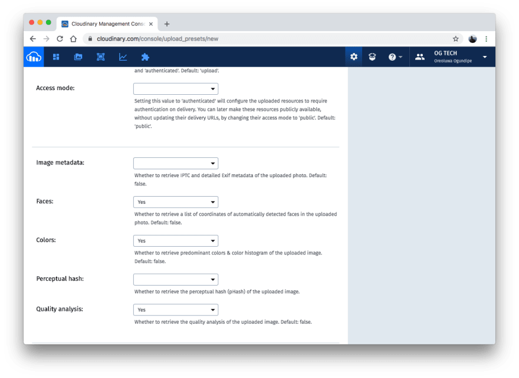

# Setting Up a Cloudinary Account

To handle image uploads in this app, leverage [Cloudinary](https://cloudinary.com/). First, [create an account](https://cloudinary.com/signup) there.

## **Find Out Your Cloud Name**

Cloudinary then takes you to your **Dashboard** \(media console\), in which your cloud name is displayed under **Account Details** \(see the screenshot below\). Replace the `CLOUDINARY_CLOUD_NAME` variable in the `ClCamera` component in the previous code segments with that name.

## **Create a Cloudinary Upload Preset**

Cloudinary Upload Presets enable you to set up the default behavior of your image uploads. That means that, instead of having to add parameters to apply to your images every time you upload one, you can define tags, transformations, and other analysis presets from your Cloudinary console. Simply specify the the preset name in your code and you’re good to go!

To create a preset, go to the [Upload Settings](https://cloudinary.com/console/settings/upload) screen and click the **Add upload preset** link:

The **Add upload preset** screen is then displayed:

Type a name of your choice under **Preset name**, set **Mode** to **Unsigned**, and then specify the other details, as appropriate.

When the `ClCamera` component uploads an image from your app, Cloudinary returns a data element that contains the information relevant to the image. That way, if you set up an Upload Preset to perform such tasks as face detection, image-color analysis, and object detection, Cloudinary returns the results to you for use as you deem appropriate. By default, Cloudinary returns the URL of your uploaded image.

