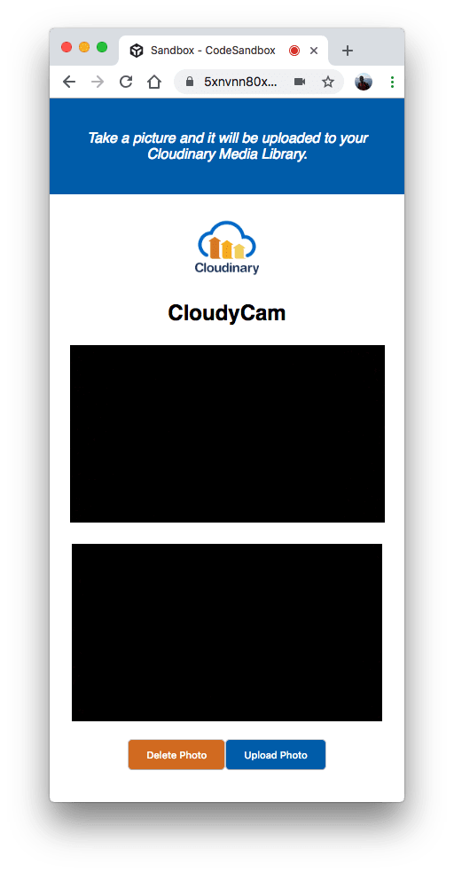
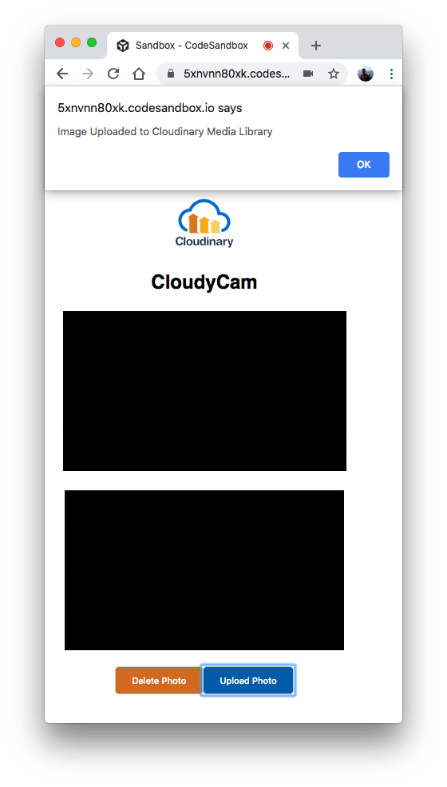
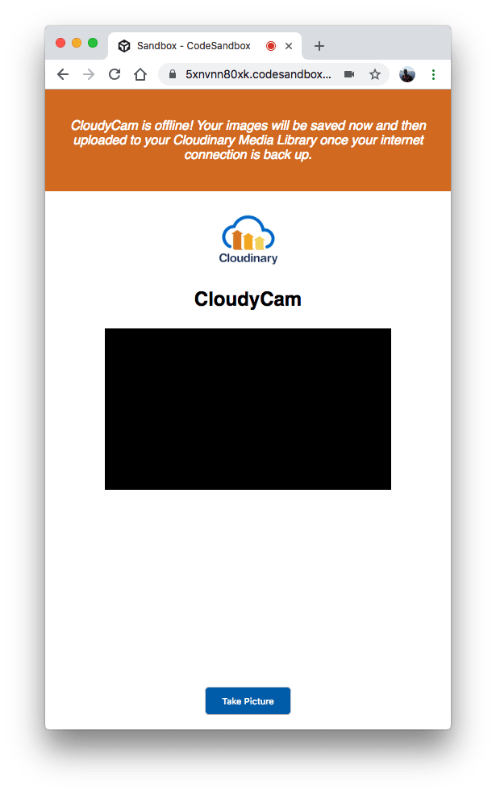
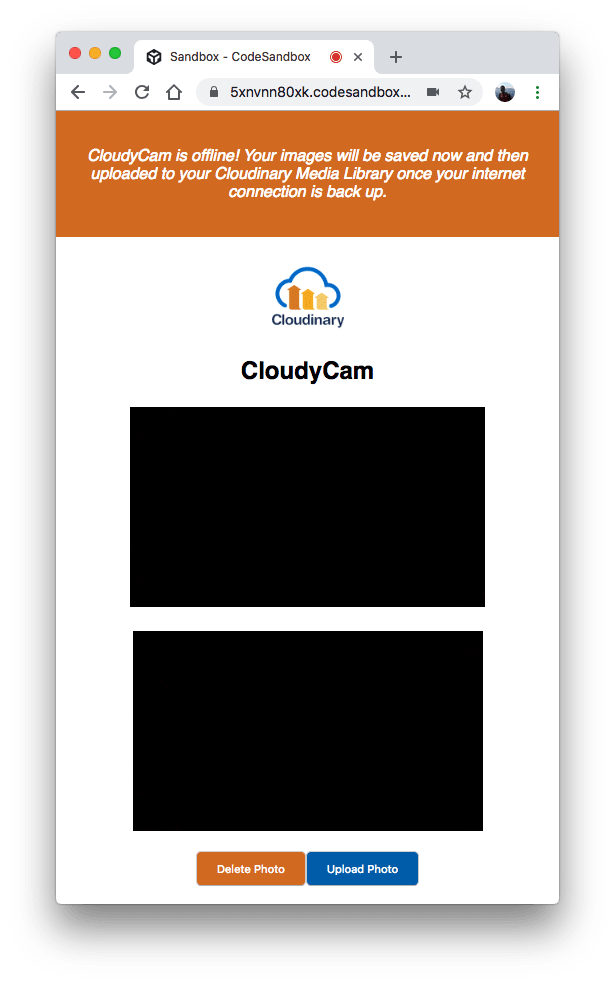
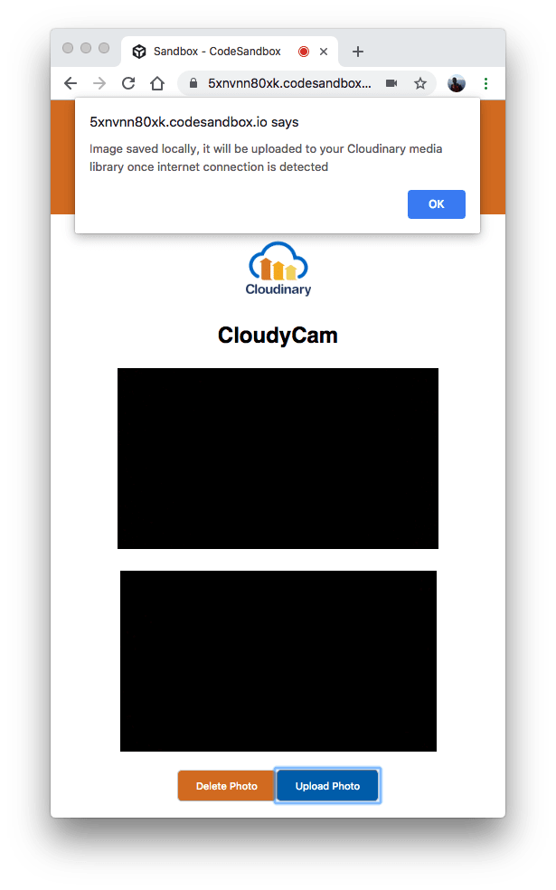

# Testing Your App

`ClCamera` is now ready for use. Update your `App.js` file to render the component, as follows:

```text
    // src/App.js

    // other imports
    [...]
    import ClCamera from "./components/ClCamera";

    class App extends Component {

      // other component methods
      [...]
      render() {
        return (
          <div className="App">
            <Notifier offline={this.state.offline} />
            <header className="App-header">
              
              <h1 className="App-title">CloudyCam</h1>
            </header>
            <ClCamera offline={this.state.offline} />
          </div>
        );
      }
    }

    export default App;
```

Next, ensure that your development server is running on `http://localhost:3000`. Navigate to that URL on your browser and verify that the various versions of your app are displayed:











